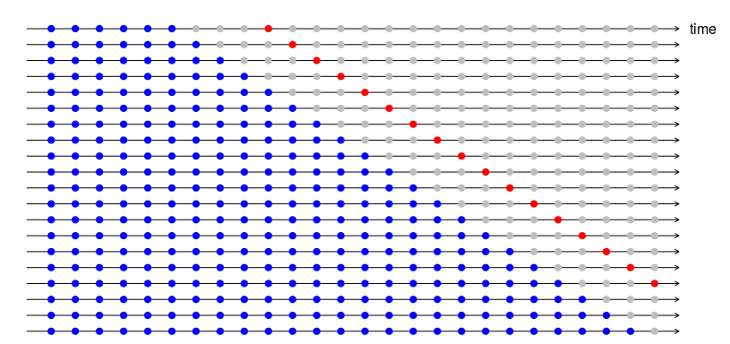

<style>
  slides > slide {
  overflow-x: auto !important;
  overflow-y: auto !important;
  }
</style>

```{r setup, include=FALSE}
knitr::opts_chunk$set(echo = FALSE)
inpath='C:/Subversion/PRO/MCT/ForecastingElectricityPrice2019/01Transformierte'
outpath='C:/Subversion/PRO/MCT/ForecastingElectricityPrice2019/02Forecasts'
require(neuralnet)
require(forecast)
require(nnfor)
require(DataVisualizations)
require(lubridate)
require(ggplot2)
```

## 1. Simple Decomposition Model
- Trend: average of last 168 Hours (week)
- Season: weekly average over the training data
- Automatization possible, e.g. prophet of Facebook
- ANNs should be at least better than this model!

```{r,echo = TRUE}
setwd(inpath)
load(file = 'PreparedDataAndWeeklySaisonality.rda')
length(FullTime) == nrow(Data)
Univariate = Data[, 'SYS']
plot(FullTime, Univariate,
     type = 'l',xlab='Time',
     ylab='Sys in Euro/MWh',
     main='Trend+WeeklySaison (red) Forecast, Data (black)')
points(FullTime,
       DecompositionModel_simple,
       type = 'l',
       col = 'red')

```

## 2. A Gentle Introduction Into Rolling Forecasts

Handling Uncertainty:

- Do not make static forecasts, i.e. use whole 𝑌_𝑡 in order to build and evaluate the forecasting model 
    - Divide into training and test set, see Knowledge Discovery lectures for overview
- Use dynamic forecasts, i.e. out of sample forecasting: $Y_t=[y_1,...,y_f,y_{f+1},...y_{f+h}]$

1. Build and evaluate model on training set $[y_1,...,y_f]$, e.g.
    - Estimate parameters
    - Investigate Residuals
    - …
2. Evaluate forecast on test set $y_{f+1},...,y_{f+h}$
3. Repeat 

## 2.1 Cross-Validation by Rolling Forecasts

- Statistical large enough out-of-sample forecasting is important
    - 365*24+1=8761 Forecasts will be generated on test data
- Forecast horizon is set to 24 hours
- Naiv means that all 24 hours have the same value as the last known hour priory
- Ensemble: Forecasting techniques can be aggregated with the goal to balance the limitations of simpler models
    - Here: average of Naiv and decomposition model
    - See SI-A for usual application
        
## 2.2 Principle for Rolling Forecasts
- Following code generates a named list of length 8761
    - Names are the time stamps of the forecast origin (present value)
    - Each elements contains a data frame of the time stamps that are predicted, the test values (future) and the forecasts (predicted values based on the past and present)
    - IMPORTANT: The models never use the test set!


```{r, out.width = "600px",echo=FALSE}

```

```{r,echo = TRUE}
#Test Set will be 2018
year = lubridate::year(FullTime)
#prior to start always training data (blue)
start = min(which(year == 2018))
#end of test data (gry points)
ende = max(which(year == 2018))
#red point
forecasthorizon = 24 #in hours

#Initialize lists
Naiv_F = list()
SimpleDecomp_F = list()
EnsembleBaseline_F = list()
rollingForecastInd = 1
TimeOfForcast = c()
#i-1 is the forecast origin
for (i in start:ende) {
  #training data (blue points)
  TrainingData = Data[1:(i - 1), ]
  #Only a sample of test data is used (grey points)
  RelvantRangeInd = (i):(i + forecasthorizon - 1)
  TestTime = FullTime[RelvantRangeInd]
  TestData = Univariate[RelvantRangeInd]
  #"Training" for naiv model
  model_naiv = tail(TrainingData[, 'SYS'], 1)
  #"Forecasting" for naiv model
  NaivForecastTmp = rep(model_naiv, forecasthorizon)
  NaivForecast = data.frame(Time = TestTime,
                            TestData = TestData,
                            Forecast = NaivForecastTmp)
  
  #Baseline
  #we already used the training set for model generation
  # "forecasting" in the decomposition model
  simpleModel = data.frame(Time = TestTime,
                           TestData = TestData,
                           Forecast = DecompositionModel_simple[RelvantRangeInd])
  
  #ensemble with a weighted average
  ensemble = data.frame(
    Time = TestTime,
    TestData = TestData,
    Forecast = 0.6 * DecompositionModel_simple[RelvantRangeInd] + 0.4 * NaivForecastTmp
  )
  
  #Structured Storing of Forecasts
  Naiv_F[[rollingForecastInd]] = NaivForecast
  SimpleDecomp_F[[rollingForecastInd]] = simpleModel
  EnsembleBaseline_F[[rollingForecastInd]] = ensemble
  #naming of list using the time stamp
  # of the origin of the forecast
  tt=as.POSIXct(FullTime[i - 1],
                origin = '1970-01-01 00:00.00 UTC')
  TimeOfForcast[rollingForecastInd] = as.numeric(tt)
  rollingForecastInd = rollingForecastInd + 1
}
names(SimpleDecomp_F) = TimeOfForcast
names(EnsembleBaseline_F) = TimeOfForcast
names(Naiv_F) = TimeOfForcast
```

## 2.3 Multivariate Forecasting with Artificial Neural Networks 
- Same principle as above
- ANN Require a little data wrangling depending on the method
    - Here: Multilayer perceptron network and extreme learning machines
  
- Stochastic algorithms require error handling (skipped here)  
- ANN require a fine tuning of many parameters
    - A lot of knowledge required
    - A lot of experience required
    - Not topic of this lecture
    - GIGA principle: Garbage in -> Garbage out

=> Usually a lot of preprocessing is required!
    
## 2.4 Coding Rolling Forecasts in the Case of ANN
- Stochastic algorithms require more computing resources

  => Usually computed in a VM (e.g. Microsoft Azure) in a parallelized approach 
  (for -> parallel::parLapply)

- Extreme Learning Machines (WLM) and Multilayer Perceptron feed-forward networks with back-propagation (MLP-BP) are described in SI B and SI C  
- Details -> homework

```{}
forecasthorizon = 24 #in hours
rollingForecastInd = 1
TimeOfForcast = c()
ELM_ann = list()
MLP_ann = list()
for (i in start:ende) {
  #Due to Ressource Limitations only a sample of the
  # nearest past data to the present was used:
  # last for weeks before present (i-1)
  TrainingData = as.data.frame(Data[(i - (4 * 168)):(i - 1), ])
  RelvantRangeInd = (i):(i + forecasthorizon - 1)
  TestTime = FullTime[RelvantRangeInd]
  #Target Variable
  TestData = Univariate[RelvantRangeInd]
  ## Initialization of data frames
  ELM = data.frame(
    Time = TestTime,
    TestData = TestData,
    Forecast = rep(NaN, length(TestData))
  )
  MLP = data.frame(
    Time = TestTime,
    TestData = TestData,
    Forecast = rep(NaN, length(TestData))
  )
  
  
  #Predictors with assumption that they are
  #available PRIOR to the Target
  PredictorsTest = as.data.frame(Data[RelvantRangeInd, -1])
  # Model MLP
  try({
    #error handling
    model = neuralnet::neuralnet(data = TrainingData,
                                 SYS ~ .,
                                 hidden = 4,#1layer, 4 neurons!
                                 rep = 1)
# Use at least two hidden layers, see
# Kolmogorov's Theorem, http://neuron.eng.wayne.edu/tarek/MITbook/chap2/2_3.html
  #or: https://www.sciencedirect.com/science/article/pii/S0022247X14003412
  #Forecast MLP
    forecast = neuralnet::compute(model, PredictorsTest)
    MLP$Forecast = forecast$net.result
  })
  #Data Wrangling
  TrainingTime = as.numeric(FullTime[(i - (4 * 168)):(i - 1)])
  PredictorTS = ts(data = TrainingData[, -1], start = TrainingTime[1])
  ResponseTS = ts(data = TrainingData[, 1], start = TrainingTime[1])
  #Model extreme learning machines (ELM)
  try({
    #error handling
    modelScaled = nnfor::elm(ResponseTS,
                             outplot = F,
                             reps = 5,
                             xreg = PredictorTS)
    #Forecast ELM
    PredictorTS_all = ts(data = rbind(PredictorTS, PredictorsTest),
                         start = TrainingTime[1])
    predicted = forecast::forecast(modelScaled, h = forecasthorizon, xreg =
                                     PredictorTS_all)
    ELM$Forecast = predicted$mean
  })
  #Storing the Forecast systematically
  ELM_ann[[rollingForecastInd]] = ELM
  MLP_ann[[rollingForecastInd]] = MLP
  #naming of list
  TimeOfForcast[rollingForecastInd] = as.numeric(as.POSIXct(FullTime[i -
                                                                       1],
                                                            origin = '1970-01-01 00:00.00 UTC'))
  rollingForecastInd = rollingForecastInd + 1
}
names(ELM_ann) = TimeOfForcast
names(MLP_ann) = TimeOfForcast
setwd(outpath)
save(file = 'ElectricityPrice_ANN_Forecasts.rda', ELM_ann, MLP_ann)
```

## 3.1 Quality Measure Definition
- Beware: there are many methods of averaging 

-> Lectures of knowledge discovery

```{r,echo = TRUE}
setwd(outpath)
load(file = 'ElectricityPrice_ANN_Forecasts.rda')#, ELM_ann, MLP_ann)
setwd(inpath)

## Evaluation
MAE = function(TestData, Forecast, InterestingRange) {
  #beware: could be other mean definition too!!
  #(e.g. median,...)
  if (missing(InterestingRange))
    InterestingRange = 1:length(TestData)
  if (length(TestData) != length(Forecast))
    stop('Unequal length!')
  if (sum(!is.finite(Forecast[InterestingRange])) == length(TestData[InterestingRange])) {
    return(999)# forecast did not work
  } else{
    return(mean(abs(TestData - Forecast)[InterestingRange], na.rm = T))
  }
}
```

## 3.2 Benchmarking
- Evaluation time interval of test set does not necessarily have to be the whole interval of forecasting

```{r,echo = TRUE}
#What is the relevant range for evaluation?
#assumption: full forecast range of 1 day
Naiv = sapply(Naiv_F, function(x)
  return(MAE(x$TestData, x$Forecast, 1:24)))
SimpleDecomposition = sapply(SimpleDecomp_F, function(x)
  return(MAE(x$TestData, x$Forecast, 1:24)))
EnsembleMAE = sapply(EnsembleBaseline_F, function(x)
  return(MAE(x$TestData, x$Forecast, 1:24)))
ELM = sapply(ELM_ann, function(x)
  return(MAE(x$TestData, x$Forecast, 1:24)))
MLP = sapply(MLP_ann, function(x)
  return(MAE(x$TestData, x$Forecast, 1:24)))
MAE_all = cbind(Naiv, SimpleDecomposition, EnsembleMAE, ELM, MLP)

```

## 3.3 Results of Benchmarking
- Usual performance evaluation is done with first order statistics or box plots

```{r,echo = TRUE}
#usualy performance evaluation
apply(MAE_all, 2, mean, na.rm = T)
apply(MAE_all, 2, sd, na.rm = T)
```

## 3.4 Visualizations Can be Misleading
- For Example: box plots do not account for bimodality

```{r,echo = TRUE,message=FALSE, warning=FALSE}
#Use sign(x)*Log10(x+1)
LogMAE = apply(MAE_all, 2, DataVisualizations::SignedLog)
DataVisualizations::InspectBoxplots(LogMAE) +
  theme_bw() +
  ylab('Log MAE in Euro/MWh') +
  ggtitle('Benchmarking Results of Electricity Price Forecasting') +
  xlab('Horizon of Forecast of 24 hours, Resolution Hours, Full Interval in Test data compared')
```

## 3.5 Detailed Benchmarking by Estimating the pdf
- Use Mirrored-Density plots (MDplots), [Thrun, et al.,2019]
    - [MD plot Documentation] (https://md-plot.readthedocs.io/en/latest/index.html)

```{r,message=FALSE,echo = TRUE}
MDplot(MAE_all,
       Scaling = 'Log',
       Ordering = 'Alphabetical') +
  ylab('Log MAE in Euro/MWh') +
  ggtitle('MDplot: Estimating the Probability Density Functions of the Errors') +
  theme_bw() +
  xlab('Horizon of Forecast of 24 hours, Resolution hours, Full Interval in Test Data Compared')
```

## 3.6 Quality Assessment
- Best method should be at least better than the average fluctuations of a day

```{r,message=FALSE,echo = TRUE}
Testdaten = lapply(Naiv_F, function(x)
  return(x$TestData))
AverageHourlyFluctuation = sapply(Testdaten, function(x)
  mean(abs(diff(x))))

qualityComparison = cbind(subset(MAE_all, select = 'EnsembleMAE'),
                          AverageHourlyFluctuation)
colnames(qualityComparison)
MDplot(qualityComparison,
       Ordering = 'Columnwise') +
  ylab('MAE in Euro/MWh') +
  ggtitle('Is the best algorithm really useful?') +
  theme_bw() +
  xlab('Horizon of Forecast of 24 hours, Resolution Hours, Full Interval in Test Data Compared')
```

## 4. Conclusion
- ANNs are not fine tuned and MLP is sometimes unable to perform a forecast (MAE=999)

-> Always apply defensive programming, many errors in data science are the result of unforeseen circumstances

- The more you play the role of a detective in data science the better your results will get
    - e.g. instead of box plot or mean and standard deviation use MDplot
    
 - Be very critical with you results

=> forecasts were not satisfactory!

Obvious Reason:

- Decomposition model is too simple 
- CAUSALITY: Predictors used for target variable "SYS" can be accessed PRIOR to the time interval of forecasting in reality
    - For example, an major issue if one uses weather features as predictors
    - In such case, the forecast horizon is restricted to max. 7 days ahaead
    
- What do you think were the implicit assumptions made here?

## Supplementary Information A: Remark on Ensembles
- Are there time dependencies for which one model is better than another?
- Phases of high fluctuations in energy price: February-March, October-November
- Stable energy price: Juni-September
- Deeper investigation required

=> Ensemble is usual based on rules or prior knowledge (either time dependent or fuzzy)

```{r,echo = TRUE}
Time = as.POSIXct(as.numeric(names(Naiv)), origin = '1970-01-01')
plot(
  Time,
  Naiv,
  type = 'l',
  col = 'blue',
  xlab = 'Time of Forecast Origin in 2018',
  ylab = 'MAE of Electricity Price in Euro/MWh',
  main = 'BLUE: NAIV, BLACK: Decomposition, RED: Ensemble'
)
points(Time,
       SimpleDecomposition,
       type = 'l',
       main = 'Error per Time',
       ylab = 'MAE')
points(Time, EnsembleMAE, type = 'l', col = 'red')
```

## Supplementary Information B: Extreme Learning Machines
 - generalized single-hidden layer feed-forward
networks [Huang et al.,2006]
 - Hidden layer of needs not be tuned
 - Randomly chooses hidden nodes
 - Claim "better generalization performance at a much
faster learning speed" [Huang et al.,2011]

## Supplementary Information C: MLP-BP
- Multilayer perceptron feed-forward network with resilient back-propagation (MLP_BP)  with weight backtracking [Anastasiadis et al., 2005]
    - Eminently suitable for applications where the gradient is numerically estimated or the error is noisy 
    - Claim: "one of the best performing sign-based learning algorithms for neural networks with arbitrary topology"
    - Five parameters to be tuned
    - Resilient Back-propagation: Iterative method for determining the minimum error function in a neural network
    - Backtracking strategy: algorithm decides whether to take back a step along a weight direction or not by means of a heuristic)
    - batch training
    - Sign-based scheme to update the weights in order to eliminate harmful influences of the derivatives’ magnitude on the weight updates